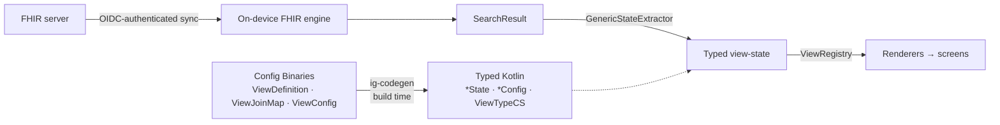

# Player Reference

A Kotlin Multiplatform / Compose Multiplatform reference client for [Open Health Stack (OHS)](https://developers.google.com/open-health-stack/overview), targeting Android, iOS, Desktop and Web from one source tree.

Screens are not hand-mapped from FHIR. Configuration authored as FHIR resources is compiled into typed Kotlin at build time, projected into flat view-state at runtime, and drawn by renderers resolved from a registry.



This repository is a GitHub template: start your own OHS app from it, or run it to see OHS end to end.

## Quick start

The app opens on a login screen and blocks on a first sync before any data is shown. **An OIDC provider and a FHIR server are both required** — there is no bundled-data demo mode.

### 1. Prerequisites

| Need | For |
| --- | --- |
| JDK 21 | every target |
| An OIDC provider with a **public** client, PKCE enabled | login |
| A FHIR R4 server reachable with that provider's tokens | data |
| [Android Studio](https://developer.android.com/studio) + Android SDK | Android only |
| Xcode | iOS only |

### 2. Configure

```shell
git clone git@github.com:ohs-foundation/player-reference.git
cd player-reference
cp local.properties.sample local.properties
```

At minimum set `OAUTH_ISSUER`, `OAUTH_CLIENT_ID` and `FHIR_BASE_URL`. Every key is documented in [`local.properties.sample`](./local.properties.sample) and summarised under [Configuration](#configuration). Values are baked in at build time, so **edits need a rebuild, not just a restart**.

### 3. Register the redirect URIs

Add all of these to the client at your provider, or only the ones for the platforms you run:

| Platform | Redirect URI | Built from |
| --- | --- | --- |
| Android, iOS | `dev.ohs.player.reference.app://auth` | `OAUTH_REDIRECT_SCHEME` + `OAUTH_REDIRECT_HOST` |
| Desktop (JVM) | `http://127.0.0.1:8765/callback` | `OAUTH_DESKTOP_REDIRECT_PORT` |
| Web (JS/Wasm) | `http://localhost:8080/callback` | `OAUTH_WEB_REDIRECT_URL`, verbatim |

### 4. Run

Desktop is the fastest path — JDK 21 only, no Android SDK, no Xcode:

```shell
./gradlew :reference-app:run
```

| Target | Command |
| --- | --- |
| Desktop | `./gradlew :reference-app:run` |
| Android | `./gradlew :reference-app:assembleDebug` |
| Web (Wasm) | `./gradlew :reference-app:wasmJsBrowserDevelopmentRun` |
| Web (JS) | `./gradlew :reference-app:jsBrowserDevelopmentRun` |

For iOS, open [`iosApp/`](./iosApp) in Xcode and run.

Use `gradlew.bat` on Windows, and run every command from the repository root. Code generation is part of the build — `generateIgCode` and `generateAuthConfig` run before Kotlin compilation, so there is no separate generation step.

## Configuration

`local.properties` is git-ignored and read by the `generateAuthConfig` task into `GeneratedAuthConfig`. Precedence is **env var > `local.properties` > default**, so CI overrides any key by exporting it under the same name.

| Key | Default | Purpose |
| --- | --- | --- |
| `OAUTH_ISSUER` | `https://keycloak.example.org/realms/ohs-player` | OIDC issuer. Endpoints are discovered from `{issuer}/.well-known/openid-configuration`; nothing else is configured. |
| `OAUTH_CLIENT_ID` | `ohs-player-reference-app` | Public client id. PKCE only — there is no client secret. |
| `OAUTH_SCOPES` | `openid profile email offline_access` | Space separated. `offline_access` is what yields a refresh token. |
| `OAUTH_REDIRECT_SCHEME` | `dev.ohs.player.reference.app` | Android/iOS deep-link scheme. |
| `OAUTH_REDIRECT_HOST` | `auth` | Android/iOS deep-link host. |
| `OAUTH_DESKTOP_REDIRECT_PORT` | `8765` | Port for the desktop loopback listener. |
| `OAUTH_WEB_REDIRECT_URL` | `http://localhost:8080/callback` | Full URL the browser returns to on web. |
| `FHIR_BASE_URL` | `https://hapi.fhir.org/baseR4` | FHIR R4 base URL for sync. Requests carry the session's bearer token. |

Each platform uses its idiomatic flow: Chrome Custom Tabs on Android, `ASWebAuthenticationSession` on iOS (no `Info.plist` entry needed), a loopback HTTP server on desktop, and a full-page redirect on web.

Two things to know:

- **The Android intent-filter tracks these automatically** — the build injects `OAUTH_REDIRECT_SCHEME` / `OAUTH_REDIRECT_HOST` into [`AndroidManifest.xml`](./reference-app/src/androidMain/AndroidManifest.xml) as manifest placeholders, so the `LoginRedirectActivity` deep link cannot drift from the generated config. Changing them still means registering the new redirect URI at your provider.
- Android Studio writes `sdk.dir` into the same `local.properties`. Keep it; Android and `allTests` builds need it.

### Keycloak example

```shell
docker run -p 8081:8080 -e KC_BOOTSTRAP_ADMIN_USERNAME=admin \
  -e KC_BOOTSTRAP_ADMIN_PASSWORD=admin quay.io/keycloak/keycloak:26.0 start-dev
```

Create a realm, add an OpenID Connect client with **Client authentication off** (public) and **Standard flow** on, paste the redirect URIs from step 3, then set:

```properties
OAUTH_ISSUER=http://localhost:8081/realms/<realm>
OAUTH_CLIENT_ID=<client-id>
```

A plaintext `http://localhost` issuer works for desktop and web. Android blocks cleartext traffic by default and the emulator cannot reach the host's `localhost`, so use an HTTPS issuer there.

## What the app does

Sign in (OAuth 2.0 + PKCE) → a blocking first sync → a household register in a navigation drawer → household profile → patient profile. `Patient` and `Group` are synced; local edits are uploaded as a bundle. Periodic sync then runs on a 15-minute interval via WorkManager on Android and a coroutine scheduler on desktop and web, and as an OS-scheduled `BGProcessingTask` on iOS.

Household registration, member capture and clinical data entry run through FHIR Structured Data Capture questionnaires, with template extraction writing the resulting resources back into the engine.

## How it works

### 1. Author configuration

A `ViewDefinition` declares the columns of a view as FHIRPath expressions over a resource — excerpt from [`Binary-PatientSummary.json`](./reference-app/src/commonMain/composeResources/files/states/Binary-PatientSummary.json):

```json
{
  "resourceType": "https://sql-on-fhir.org/ig/StructureDefinition/ViewDefinition",
  "name": "PatientSummary",
  "status": "active",
  "resource": "Patient",
  "select": [
    {
      "column": [
        { "name": "patientId", "path": "id", "type": "http://hl7.org/fhir/StructureDefinition/string" },
        { "name": "familyName", "path": "name.family.first()", "type": "http://hl7.org/fhir/StructureDefinition/string" },
        { "name": "birthDate", "path": "birthDate", "type": "http://hl7.org/fhir/StructureDefinition/date" },
        { "name": "mrn", "path": "identifier.where(type.coding.code = 'MR').value.first()", "type": "http://hl7.org/fhir/StructureDefinition/string" }
      ]
    }
  ]
}
```

A `ViewJoinMap` names the view-state and binds it to a pivot `ViewDefinition` (plus any joined views) — [`Binary-PatientSummaryState.json`](./reference-app/src/commonMain/composeResources/files/states/Binary-PatientSummaryState.json):

```json
{
  "resourceType": "http://ohs.dev/StructureDefinition/ViewJoinMap",
  "name": "patientSummary",
  "from": "root",
  "resource": "Patient",
  "view": "PatientSummary"
}
```

A `ViewConfig` declares the configuration a renderer accepts, with defaults — excerpt from [`Binary-PatientCardConfig.json`](./reference-app/src/commonMain/composeResources/files/configs/Binary-PatientCardConfig.json):

```json
{
  "resourceType": "http://ohs.dev/StructureDefinition/ViewConfig",
  "viewType": "PatientCard",
  "property": [
    { "name": "showStatusChip", "type": "boolean", "valueBoolean": true },
    { "name": "elevation", "type": "decimal", "valueDecimal": 2.0 }
  ]
}
```

One `CodeSystem` enumerates every view-type the app renders — [`CodeSystem-ViewTypes.json`](./reference-app/src/commonMain/composeResources/files/viewtypes/CodeSystem-ViewTypes.json).

### 2. Generate typed Kotlin

The `ig-codegen` plugin reads those files from `src/commonMain/composeResources/files/` — `states/`, `configs/`, `viewtypes/` — and emits sources onto the `commonMain` source set:

```kotlin
igCodegen {
    // sourcesDir defaults to src/commonMain/composeResources/files
    packageName = "dev.ohs.player.generated"
}
```

| Generated symbol | Source | Package |
| --- | --- | --- |
| `PatientSummaryState` and other `*State` classes | ViewJoinMap + columns | `dev.ohs.player.generated.state` |
| `PatientCardConfig` and other `*Config` classes | ViewConfig | `dev.ohs.player.generated.config` |
| `ViewTypeCS` | CodeSystem | `dev.ohs.player.generated.viewtype` |
| `GeneratedConfigManifest` | file listing | `dev.ohs.player.generated` |

Scalar columns become nullable fields, collection columns become `List<T>`:

```kotlin
@Serializable
data class PatientSummaryState(
    val patientId: String? = null,
    val familyName: String? = null,
    val givenName: String? = null,
    val gender: String? = null,
    val birthDate: FhirDate? = null,
    val active: Boolean? = null,
    val mrn: String? = null,
    val phone: String? = null,
)
```

### 3. Extract view-state

A `ConfigStore` holds the parsed configuration and is fed by a `ConfigSource`. [`LocalConfigSource`](./reference-app/src/commonMain/kotlin/dev/ohs/player/reference/app/data/datasource/LocalConfigSource.kt) reads the bundled Binaries; swapping it for an HTTP fetch is the only change needed to serve configuration from a backend.

```kotlin
object Extraction {
    private val configStore: ConfigStore = ConfigStore(LocalConfigSource)
    val extractor: GenericStateExtractor = GenericStateExtractor(configStore)
}
```

`extract<T>()` selects the configuration for `T` by name, evaluates its FHIRPath columns against a `SearchResult` — the pivot resource plus forward- and reverse-included resources, mirroring a FHIR search response — and returns typed results:

```kotlin
suspend fun getPatients(): List<PatientSummaryState> =
    withContext(extractorDispatcher) {
        allPatientIds(fhirRepository).mapNotNull { id ->
            patientSummarySearchResult(id, fhirRepository)?.let {
                extractor.extract<PatientSummaryState>(it).firstOrNull()
            }
        }
    }
```

The FHIRPath engine holds mutable evaluation state and is not concurrency-safe, so extraction is serialised on `Dispatchers.Default.limitedParallelism(1)`.

### 4. Render

A `ComponentRenderer<T, C>` draws one item of state `T` with configuration `C`. The same renderer class can be registered under several view-types with different configuration.

```kotlin
class PatientCardRenderer : ComponentRenderer<PatientSummaryState, PatientCardConfig> {
    @Composable
    override fun Render(
        item: PatientSummaryState,
        config: PatientCardConfig,
        options: RenderOptions,
    ) {
        PatientCard(patient = item, config = config, onClick = options.onClick)
    }
}
```

Registrations are grouped per feature and assembled once. `LayoutRenderer<T>` is the arrangement counterpart; the library ships `VerticalListRenderer`, `HorizontalListRenderer` and `GridListRenderer`.

```kotlin
fun ViewRegistry.registerPatientList() {
    registerComponent<PatientSummaryState, PatientCardConfig>(
        ViewTypeCS.PatientCard,
        PatientCardRenderer(),
        PatientCardConfig(),
    )
    registerLayout<PatientSummaryState>(
        VerticalListRenderer.VIEW_TYPE,
        VerticalListRenderer(
            contentPadding = PaddingValues(horizontal = 8.dp, vertical = 8.dp),
            itemSpacing = 2.dp,
        ),
    )
}

fun buildAppViewRegistry(): ViewRegistry = ViewRegistry().apply {
    registerGroupList()
    registerGroupProfile()
    registerPatientList()
    registerPatientProfile()
}
```

The registry is installed at the composition root, so screens depend on view-types rather than concrete UI classes:

```kotlin
val registry = remember { buildAppViewRegistry() }
CompositionLocalProvider(LocalViewRegistry provides registry) {
    OhsPlayerTheme { /* auth gate, sync gate, NavHost */ }
}
```

List screens use `ListScaffold`, whose builder names view-types instead of composables. Omitting `layout(...)` falls back to `VerticalListRenderer`; an empty list renders `emptyState` without invoking the layout renderer.

```kotlin
ListScaffold<PatientSummaryState>(
    items = patients,
    onItemClick = { onPatientClick(it.patientId ?: "") },
    key = { it.patientId ?: it.hashCode().toString() },
) {
    component(ViewTypeCS.PatientCard)
    layout(VerticalListRenderer.VIEW_TYPE)
    topBar { TopAppBar(title = { Text(stringResource(Res.string.patient_list_title)) }) }
    emptyState { Text(stringResource(Res.string.patient_list_empty)) }
}
```

Detail screens compose sections by resolving renderers directly, which lets one screen mix several state types — see [`PatientProfileScreen.kt`](./reference-app/src/commonMain/kotlin/dev/ohs/player/reference/app/feature/patient/profile/PatientProfileScreen.kt):

```kotlin
val registry = LocalViewRegistry.current
val headerRenderer = remember(registry) {
    registry.componentRenderer<PatientSummaryState>(ViewTypeCS.PatientHeader)
}
```

A lookup is keyed by both view-type and state type; a miss throws `NoSuchElementException` naming the missing key.

**Adding a field is a configuration change**: add a column to the `ViewDefinition`, then use the regenerated state field in the renderer. No extraction or wiring code changes.

You do not need this template to use the player — it is a library, not a framework, and can be adopted one screen at a time in any Kotlin Multiplatform or Android project:

```kotlin
commonMain.dependencies {
  implementation("dev.ohs.player:client:1.0.0-alpha01")
}
```

The [library README](https://github.com/ohs-foundation/player-client#readme) is the standalone user guide; this repository is the worked example.

## Customizing the template

Click **Use this template → Create a new repository** on GitHub, then work through these:

- **Application id / namespace** — `applicationId` and `namespace` in [`reference-app/build.gradle.kts`](./reference-app/build.gradle.kts), the iOS bundle id in [`iosApp/Configuration/Config.xcconfig`](./iosApp/Configuration/Config.xcconfig), and the Kotlin package `dev.ohs.player.reference.app`.
- **Application name** — Android [`strings.xml`](./reference-app/src/androidMain/res/values/strings.xml), iOS `PRODUCT_NAME`, desktop `packageName` in the `compose.desktop` block, web `<title>` in [`index.html`](./reference-app/src/webMain/resources/index.html).
- **Icons** — `reference-app/src/androidMain/res/mipmap-*/`, `iosApp/iosApp/Assets.xcassets`, and `reference-app/desktop-icons/`.
- **Generated code package** — `packageName` in the `igCodegen` block.
- **Project names** — `rootProject.name` and the module name in [`settings.gradle.kts`](./settings.gradle.kts). Renaming either changes the package of the generated Compose `Res` class.
- **Screens and configuration** — the `Binary-*.json` files under `reference-app/src/commonMain/composeResources/files/` and the renderers under `reference-app/src/commonMain/kotlin/.../feature/`.

## Testing

```shell
./gradlew :reference-app:jvmTest    # JVM — what CI runs
./gradlew :reference-app:allTests   # all platforms; needs the Android SDK
```

## CI and release

[`ci.yml`](./.github/workflows/ci.yml) validates every pull request and push to `main`: spotless formatting, `jvmTest`, Android `lintDebug`, and an iOS compile-and-link on macOS runners for `iosArm64` and `iosSimulatorArm64`.

Pushing a semantic version tag (`vX.Y.Z` or `vX.Y.Z-suffix`) triggers [`release.yml`](./.github/workflows/release.yml), which builds and signs every platform and publishes a GitHub Release with checksummed artifacts: an Android APK, desktop installers (`.deb`, `.rpm`, `.msi`, `.dmg`) and a portable Linux tarball. A `workflow_dispatch` run is a dry run — it builds and uploads artifacts but publishes no Release. The web and GitHub Pages jobs are gated off (`if: false`) pending a larger runner; the web preview is deployed manually meanwhile.

### App configuration on CI

`local.properties` is git-ignored, so it does not exist on a runner. Release builds
read the same keys from environment variables instead, which `release.yml` maps from
**repository variables** in a workflow-level `env:` block. Repository variables are not
environment variables on their own — they live only in the `vars` context and must be
mapped explicitly, or the build silently falls back to the placeholder defaults.

Set these under **Settings → Secrets and variables → Actions → Variables**:

`OAUTH_ISSUER`, `OAUTH_CLIENT_ID`, `OAUTH_SCOPES`, `OAUTH_REDIRECT_SCHEME`,
`OAUTH_REDIRECT_HOST`, `OAUTH_DESKTOP_REDIRECT_PORT`, `OAUTH_WEB_REDIRECT_URL`,
`FHIR_BASE_URL`.

The `Preflight` job fails the run if any of them is unset, so a typo surfaces in the
first minute rather than in a shipped artifact.

Local installers:

```shell
./gradlew :reference-app:packageDmg                 # macOS .dmg
./gradlew :reference-app:packageMsi                 # Windows .msi
./gradlew :reference-app:packageDeb                 # Linux .deb
./gradlew :reference-app:createDistributable        # portable app image
./gradlew :reference-app:wasmJsBrowserDistribution  # web bundle
```

### Android release signing

Release builds read signing inputs from environment variables first, then fall back to a `keystore.properties` file:

```shell
cp keystore.properties.template keystore.properties
# fill in keystore path, alias and passwords, then:
./gradlew :reference-app:bundleRelease
```

`keystore.properties` is git-ignored and must never be committed. `ANDROID_KEYSTORE_PATH`, `ANDROID_KEY_ALIAS`, `ANDROID_KEY_PASSWORD` and `ANDROID_STORE_PASSWORD` take precedence over the file. With neither configured, release builds are emitted unsigned.

---

Learn more about [Kotlin Multiplatform](https://www.jetbrains.com/help/kotlin-multiplatform-dev/get-started.html), [Compose Multiplatform](https://github.com/JetBrains/compose-multiplatform/#compose-multiplatform).
